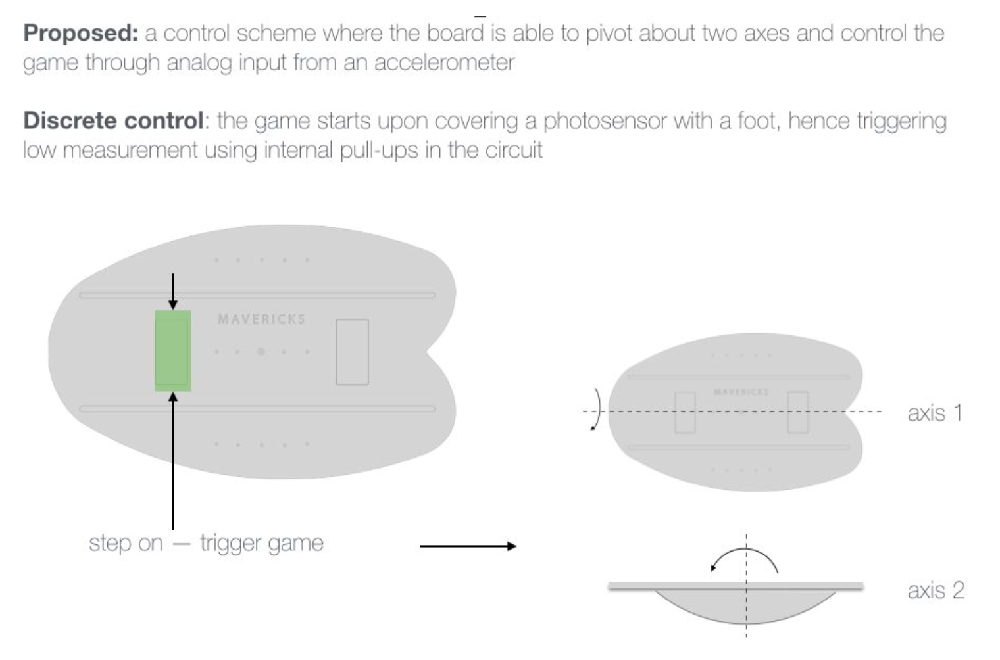
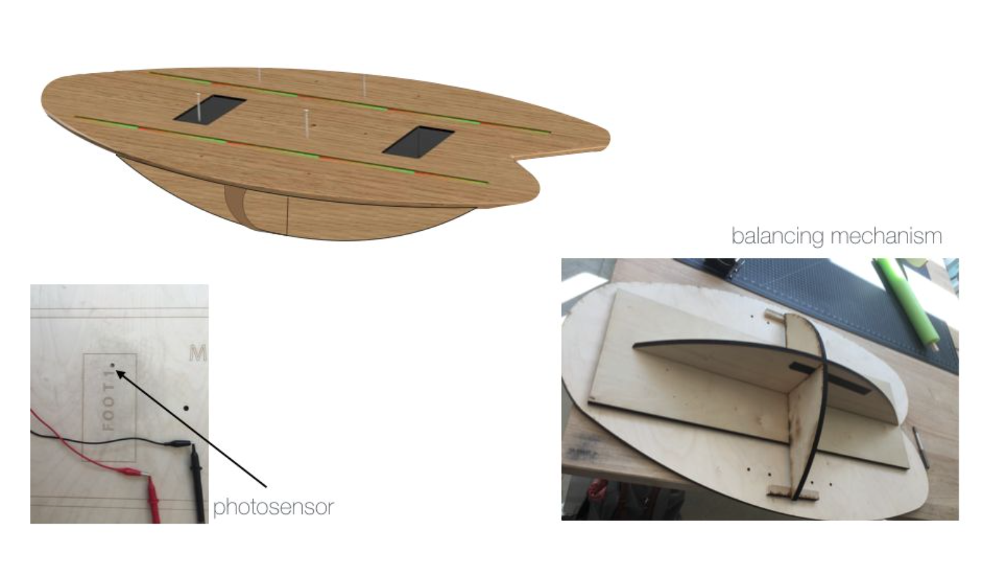
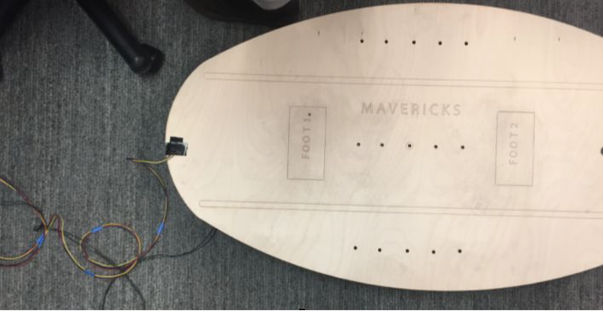
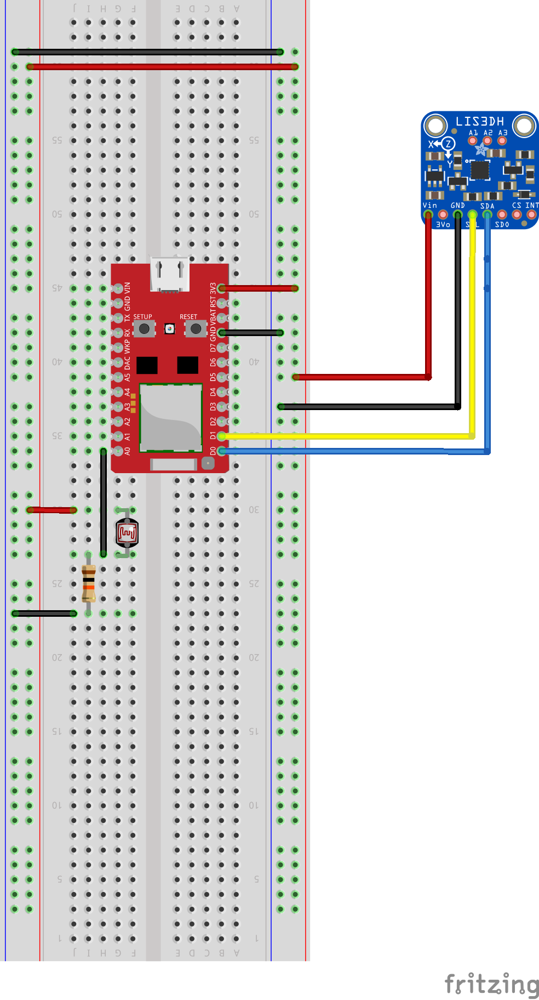
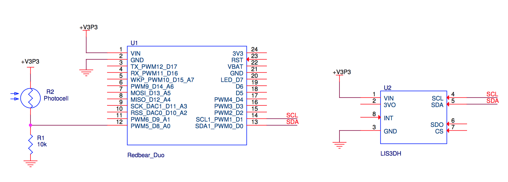

# HW3 Surf Game

##Team & Responsibilities:

**Josh Kay**: hardware and software implementation.

**Diego Rivas**: hardware design and prototype, sensor embedding, software troubleshooting and iteration.

**Juan Duarte**: board assembling and, game design and implementation in software.

##Control Scheme

A surf simulation game was designed by pairing a custom balance board peripheral with a custom video game designed in Processing. The custom balance board peripheral consisted of the Redbear Duo microcontroller, Adafruit’s LIS3DH 3 axis accelerometer, and a CdS photoresistor. Mounting the accelerometer on the front tip of the balance board allowed the backend software to sense specific angles and correlate that angle to a virtual board displayed in the game. A photocell was used to detect the presence of the player, triggering the game to begin when a user is present. The figure below shows the user behavior sensed by the balance board peripheral.

 The objective of the game is for the user to match target angles with your board peripheral in a continuously decreasing amount of time. The user gets points for each angle matched. The user loses if he cannot match the target angle in the allocated time or he falls off the board. The game can be played continuously to try to beat a high score or a target number of positions can be set. When the target number of positions is met, the user wins the game and is brought to a "win screen." The figures below show the placement of the sensors and the balancing mechanism board peripheral.

Note: accelerometer attachment in the final prototype was done with screws, this first attempt with tape was just for testing.

##Hardware implementation

The custom balance board peripheral consisted of the Redbear Duo microcontroller, Adafruit’s LIS3DH 3 axis accelerometer, and a CdS photoresistor. The figures below show the circuit diagram for the balance board peripheral.

 

The Redbear Duo was used to communicate with the LIS3DH 3 axis accelerometer through an I2C connection to read accelerometer from each of the sensor’s 3 axis. The data was then normalized to G forces and used to calculate the pitch and roll angles of the sensor. The pitch and roll of the accelerometer informed the backend software of the orientation of the balance board peripheral. Additionally, a resistor divider consisting of a 10k resistor and a photocell was used as digital input to detect when the player was standing on the board. With ambient light reaching the photocell, R2’s resistance was very low, pulling D8 to a high state. When the player was standing over the photocell, the resistance of the R2 became very high, pulling D8 on the Redbear Duo low. Thus, the photocell was used as a switch to indicate if the user was standing on the board. The Redbear Duo sent the pitch, roll, and photocell switch data through a serial connection to a remote computer at a 30Hz sampling rate. 

##Game Design:

The game was designed and coded from scratch. As mentioned in the summary, the game starts once the player steps on, triggering a photosensor by covering it with the front foot. The player matches target angles with the board in a continuously decreasing amount of time, and tries to maximize the score by getting the maximum number of matches possible.

The proposed game was implemented as the following state machine:

The game was implemented in the Processing 3 open source computer programming language. It communicates with the RedBear Duo board using serial port communications, receiving signals from accelerometer and photodiode detector, that are then utilized to take decisions in the state machine of the game.

In order to obtain a good quality graphic for the game and a sense of reality, GIF animations were incorporated at each state of the game, together with sounds and a background song.

The following figures show screen-captures at each part of the game:

Another important point to mention was that the data obtained from the accelerometer was a little noisy/shaky. Therefore, we implemented a simple filter to give a better user experience of the game. This part was done in the software of the game but it can be implemented in the ReadBoard Duo as well.

A simple demo of the proposed game with the controller incorporated can be found at [Video Surf Game](https://youtu.be/v2engGUQ7P0).

##Reflection of development:

We obtained many experiences in the HW such as product prototyping and manufacturing, sensor design and testing, game design and implementation, etc. Many of the reflections are summarized as follow:

* We obtained a lot of experience working with different type of woods. We found out that Plywood - 1/2" x 24" x 48" is cheaper ($6) and stronger than the Plywood - 1/4" x 24" x 48" ($15). However, the time needed to laser cut was much longer for the thicker material
* We found out that to stick parts for the board, the glue available in Jacobs is really strong!
* Most members of our group were not familiar with the open source language Processing 3. It turned out that is a very good option for fast prototyping of software which includes graphics and communication with boards such as RedBear Duo or Arduinos.
* The use of animated GIFs give a sense of reality of the game. They are light, easy to implement, and there a lot of them available online.
* A filter was needed to smooth out the data obtained from the accelerometer; otherwise, the board position was too noisy/shaky.
* The photodiode was the best option to sense if the player was over the board. Mainly because we could add a hole in the board a put the sensor there, so player would not feel the sensor if she/he step into it. Other sensor like, forze sensor, would bother the player or make the sensor attachment more difficult.

Gameplay video: [Video Surf Game](https://youtu.be/v2engGUQ7P0)

